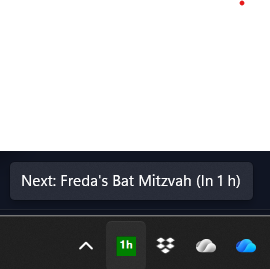

# ComingUpNext Tray

A lightweight Windows 11 tray application that displays your next upcoming meeting from a public calendar ICS (.ics) feed.

## Features
 - Tray icon with dynamic tooltip showing: `Next: <Title> (In X min|In Y h|Mon HH:mm)`
 - Auto balloon notification when a meeting is within 15 minutes (once per meeting)
 - Context menu: Open Meeting, Refresh, Set Calendar URL, Exit
 - Stores configuration in `%APPDATA%/ComingUpNext/config.json`
 - Lightweight ICS parsing (skips malformed events)
 - Configurable refresh interval (default 5 minutes) via `RefreshMinutes` in `config.json` or "Set Refresh Minutes" context menu option



## ICS Format Expectations
Provide a publicly accessible `.ics` URL (can be from Outlook, Google Calendar, etc.). The app reads `VEVENT` blocks and uses:

- `SUMMARY` → Meeting title
- `DTSTART` → Start time (all-day events treated as midnight local)
- `DTEND` → End time (if missing/invalid defaults to +1 hour)
- `URL` → Meeting link (if present)
- `DESCRIPTION` → Fallback scan for first `http`/`https` link if `URL` absent (helpful for Teams links embedded in description)

Example snippet:
```ics
BEGIN:VEVENT
SUMMARY:Daily Standup
DTSTART:20251030T090000Z
DTEND:20251030T091500Z
URL:https://teams.microsoft.com/l/meetup-join/...
END:VEVENT
```

Timezone & recurrence handling:
 - `TZID=` parameters on `DTSTART`/`DTEND` are respected (converted from that zone to local).
 - UTC times (`Z` suffix) converted to local.
 - Floating times (no TZ) treated as local.
 - Date-only values (`YYYYMMDD`) treated as all-day starting at local midnight.
 - Simple weekly `RRULE` patterns (e.g. `FREQ=WEEKLY;BYDAY=MO,WE;INTERVAL=1;UNTIL=20261102T160000Z`) are expanded for upcoming occurrences (up to 3 months lookahead or UNTIL limit) including exclusions via matching `EXDATE`.
 - `EXDATE` entries remove specific occurrences from recurrence expansion.

Limitations: Advanced recurrence (monthly rules, BYSETPOS, COUNT, exceptions with time shifts) is not yet supported.

## Build & Run
Requires .NET 9 SDK.

```powershell
# Build
dotnet build

# Run (from project directory)
cd src/ComingUpNextTray
dotnet run
```

On first run, use the tray icon context menu "Set Calendar URL" to paste the ICS URL.
Optionally adjust the refresh interval with "Set Refresh Minutes" (1-1440). The default is 5 minutes.
You can force an immediate reload at any time with the "Refresh" context menu item (it disables while fetching to avoid overlapping requests).

## Packaging
Produce a single-file self-contained executable:

```powershell
dotnet publish src/ComingUpNextTray/ComingUpNextTray.csproj -c Release -r win-x64 --self-contained true /p:PublishSingleFile=true /p:IncludeAllContentForSelfExtract=true -o publish
```
The output folder `publish` will contain the EXE. Version metadata (AssemblyVersion/FileVersion/Product Version) is taken from the `<Version>` property inside `ComingUpNextTray.csproj`.

### MSI Installer (WiX v5)
An example WiX v5 setup is provided under `installer/`.

Prerequisites:
- .NET 9 SDK
- WiX Toolset v5 (installed automatically by the build script if missing)

Build the MSI (auto-reads `<Version>` from the csproj):
```powershell
cd installer
./build.ps1 -Configuration Release -Runtime win-x64
```
Result: `installer/ComingUpNextTray-X.Y.Z.msi` where `X.Y.Z` is the version from the project file.

To override the version just for a build (without editing the csproj), pass `-Version`:
```powershell
./build.ps1 -Configuration Release -Runtime win-x64 -Version 1.2.3
```
This stamps the EXE (assembly/file/product) and the MSI Package version consistently.

Adjustments:
- Update GUID placeholders in `installer/Product.wxs` (generate new GUIDs via `New-Guid`).
- Change `Manufacturer`, `Version`, or add more components (e.g., config file defaults).
- To auto-start for current user you can add a shortcut component pointing to Startup folder or set Run key (advanced customization).

Silent install example:
```powershell
msiexec /i ComingUpNextTray-1.0.0.msi /qn
```

Uninstall:
```powershell
msiexec /x ComingUpNextTray-1.0.0.msi /qn
```

If you modify published output location or add resources, re-run the build script to regenerate harvested components.

## Auto Start (Optional)
Create a shortcut to the published EXE in:
```text
%APPDATA%\Microsoft\Windows\Start Menu\Programs\Startup
```

## Future Improvements
 - Add Windows Toast notifications using Windows App SDK for richer UX
 - Optional filtering (e.g. ignore all-day events or past events spanning multiple days)

## License
See `LICENSE`.
